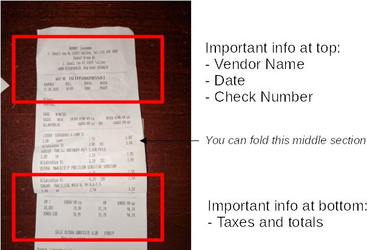

Vatinator
===

Vatinator extracts data from pictures of your receipts and fills out your Estonian VAT tax reimbursement forms.

# How to use it

1. Take a picture of each of your receipts.  Do not stamp them or write on them.  It's important that you capture the most important information at the top about the vendor and at the bottom about the taxes.  You can fold up the middle if there is nothing important there.  See the picture below.



2. Download all the pictures for the month to your computer and place them in a folder below where the vat program is installed. It doesn't matter what the receipts are called.  Just throw them all in the same folder and make sure they are rotated so they are in portrait orientation.

```shell
  |- vat.exe
  |- december
      | - my_receipt_1.jpg
      | - my_receipt_2.jpg
  |- january
      | - another_receipt_in_january.jpg
```

3. Open a terminal.  In Windows, this is called `cmd.exe`.  Push the start button and type `cmd` then hit enter.  On Mac, it's called `Terminal.app`.  Change to the directory where you have the vat program.  You can do `cd C:\Users\me\vatinator` or where ever you put it when you downloaded it.  On Mac, it will be something like `cd /Users/me/vatinator`.  Yes, I know using it in the terminal is a pain, but the web version isn't ready.

4. Run the program.  On Windows, type `vat.exe`.  On Mac, type `./vat`.  I wouldn't try double clicking on it in your file manager.  It will probably show you some scary warnings.  It's not a virus but Windows and Mac both show warnings if you don't pay them to join their developer programs.  If you don't trust me, don't use it.

5. Follow the prompts to set it up the first time.  Use the passphrase I gave you to do some one-time setup tasks and enter all the details needed to fill your forms.

6. It should find directories with your photos.  Choose the folder for the correct month.

```shell
Choose directory with this submission's receipts                                                 

 Option                                          
 0       /home/btburke/projects/vat/bin/december 
 1       /home/btburke/projects/vat/bin/january  

Choice: 
```

7. Wait while it does magic. It's going to extract all the text from the receipts and try to piece it together to get the data it needs.

8. When it's done all the output will be in the `out` folder.  It will have the VAT forms and PDFs of all your receipts.  You don't have to stamp or scan anything.  It will do that for you.

9. **IMPORTANT!!** - Review the Excel files and the `errors.txt` file.  It won't find 100% of the data.  You will have to look at the PDFs and fill in whatever is missing.  I make no guarantees that even the data it finds is 100% correct.  **You should check everything. This is your official tax form, so check it thoroughly.  I am not responsible if it makes an error.  Results are best effort only.**  That being said, it's pretty accurate.  It will place `???` in places where it's confused and will enter `0` for taxes when it's not 100% sure.

10. If it saved you time, I accept thanks in the form of booze or bidding 360s.

# Installing the program

Download the latest version from the [releases page](https://github.com/BTBurke/vatinator/releases/latest).  I fix it every time I find a problem dealing with my own receipts so you should update to the latest version each time you plan to submit your forms.  Since version 17, there is an auto updater built in, so just select yes when it tells you there is a new version available and it will auto install it.

# Bugs

There will be bugs.  If you want to help me, send me the photo that caused the problem and I'll try to update the algorithm.  It's especially helpful if you notice a particular format it has a problem with.  For example, sometimes dates can be written like `25/12/2020`, `25.12.2020`, or `25122020`.  I have to write rules for each possibility.  The more formats I know about, the more time it will save everyone in the future.

# Disclaimer

THE SOFTWARE IS PROVIDED “AS IS”, WITHOUT WARRANTY OF ANY KIND, EXPRESS OR IMPLIED, INCLUDING BUT NOT LIMITED TO THE WARRANTIES OF MERCHANTABILITY, FITNESS FOR A PARTICULAR PURPOSE AND NONINFRINGEMENT. IN NO EVENT SHALL THE AUTHORS OR COPYRIGHT HOLDERS BE LIABLE FOR ANY CLAIM, DAMAGES OR OTHER LIABILITY, WHETHER IN AN ACTION OF CONTRACT, TORT OR OTHERWISE, ARISING FROM, OUT OF OR IN CONNECTION WITH THE SOFTWARE OR THE USE OR OTHER DEALINGS IN THE SOFTWARE.


    
