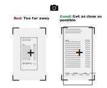

# User Guide

## Step 1: Take good pictures

Vatinator works by extracting text from an image of your receipt.  A better quality image will give you a better result.  This means:

:fontawesome-regular-check-square: Take a high resolution image (preferably with your phone)

:fontawesome-regular-check-square: Use good lighting

:fontawesome-regular-check-square: Put your receipts on a solid colored background

:fontawesome-regular-check-square: Get as close as possible while fitting all the important text in the picture

:fontawesome-regular-check-square: Fold long receipts

:fontawesome-regular-check-square: Take one picture per receipt

!!! caution "One Receipt = One File"
    Vatinator assumes that each receipt is in its own file - one image or one PDF per receipt.  Don't upload a PDF or picture with multiple receipts in it.

!!! tip "Keep Just the Important Information"
    Most of the important information for your VAT reimbursement is at the top and bottom of the receipt.  Make sure that shows up clearly in your picture.
    

!!! tip "Fold Long Receipts"
    If your receipt is longer than a piece of paper, fold the middle.  The list of what you bought isn't important as long as you keep the information needed for your reimbursement form visible.
    

!!! tip "Get Close For More Accurate Results"
    Take the picture as close to the receipt as possible while keeping all the important informaion in view.  This makes the resolution of the letters higher which improves accuracy.
    

## Step 2: Upload your receipts

Log in to [Vatinator](https://vatinator.com) and upload your receipts.  In addition to the pictures you took, you can also add PDF receipts you download from Wolt, PaartnerKaart, Selver, etc.

If you notice a problem, fix the picture and upload them all again.  There's currently no way to go back and edit the ones you've already uploaded.

## Step 3: Receive your email

Within 5-10 minutes, you'll receive an email with a zip file of your forms.

## Step 4: Review your forms

Open the excel files and check the data.  You're responsible for ensuring the information is correct.

!!! caution "Rows may be hidden"
    For some brands of Excel, rows 24-39 may appear to be hidden when you first open the file.  If it looks like there are only 3-4 receipts listed, check to make sure all the rows are visible.  You can highlight row 24-39, right click, then set the row height to 15.  That should show all the data.

!!! caution "Check tax and total"
    When the tax and total could not be determined, both will be set to `0.00`.  Enter the tax and total manually, then make sure the grand totals update at the bottom of the sheet.  You may have to highlight those grand totals and press `F9` to force them to recalculate.

